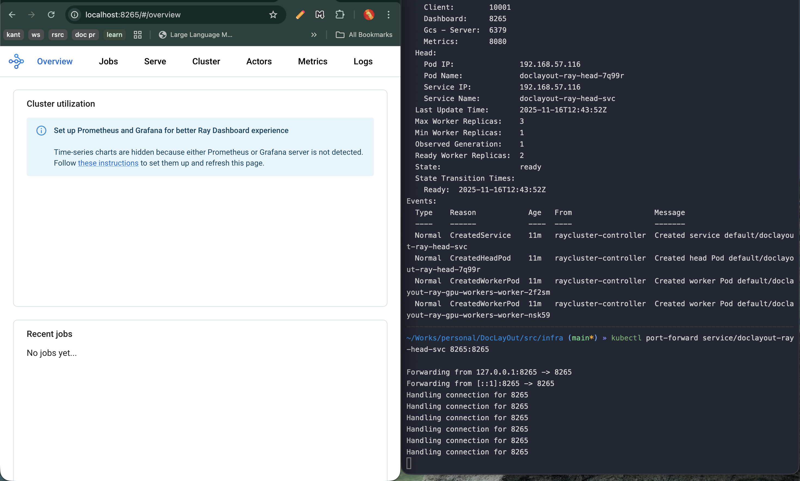
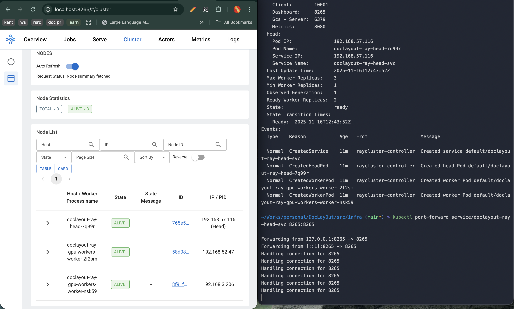

# DocLayout MLOps Infrastructure Setup Guide - Complete Reference

**Tested and Validated Setup - November 16, 2025**

Complete guide for setting up EKS cluster with Ray for DocLayout model training and inference.

## Infrastructure Overview

- **EKS Version**: 1.34
- **Ray Version**: 2.51.1
- **Region**: us-east-1
- **CPU Nodes**: 2x t4g.xlarge (ARM64, 4 vCPU, 16GB RAM each) - Min: 2, Max: 3
- **GPU Nodes**: 2x g5.xlarge (NVIDIA A10G, 24GB GPU memory each) - Min: 1, Max: 3
- **Total Cluster Resources**: 6 CPUs, 20Gi Memory, 2 GPUs

## Prerequisites

```bash
# Required tools
# 1. AWS CLI - https://aws.amazon.com/cli/
# 2. kubectl - https://kubernetes.io/docs/tasks/tools/
# 3. eksctl - https://eksctl.io/
# 4. helm - https://helm.sh/
# 5. jq - https://stedolan.github.io/jq/

# Verify installations
aws --version        # Should be 2.x or higher
kubectl version --client
eksctl version       # Should be 0.215.0 or higher
helm version
jq --version

# Configure AWS credentials
aws configure
# Enter your AWS Access Key ID, Secret Access Key, and default region (us-east-1)
```

---

## Complete Setup - Step by Step

### Step 1: Create EKS Cluster (Control Plane Only)

**Time: ~12 minutes**

```bash
# Create the cluster without node groups
eksctl create cluster \
  --name doclayout-cluster \
  --region us-east-1 \
  --version 1.34 \
  --without-nodegroup
```

**Expected Output:**
```
2025-11-16 17:56:27 [✔]  saved kubeconfig as "/Users/<username>/.kube/config"
2025-11-16 17:56:27 [✔]  all EKS cluster resources for "doclayout-cluster" have been created
2025-11-16 17:56:29 [✔]  EKS cluster "doclayout-cluster" in "us-east-1" region is ready
```

**Verify Cluster Creation:**
```bash
eksctl get cluster --name doclayout-cluster --region us-east-1
```

**Expected Output:**
```
NAME                REGION      EKSCTL CREATED
doclayout-cluster   us-east-1   True
```

**Troubleshooting:**
```bash
# If cluster creation fails, check CloudFormation
aws cloudformation describe-stacks \
  --region us-east-1 \
  --stack-name eksctl-doclayout-cluster-cluster

# Check for any error messages
aws cloudformation describe-stack-events \
  --region us-east-1 \
  --stack-name eksctl-doclayout-cluster-cluster \
  --max-items 20
```

---

### Step 2: Create CPU Node Group

**Time: ~4 minutes**

```bash
# Create CPU node group with ARM-based t4g.xlarge instances
eksctl create nodegroup \
  --cluster doclayout-cluster \
  --region us-east-1 \
  --name cpu-nodes \
  --node-type t4g.xlarge \
  --nodes 2 \
  --nodes-min 2 \
  --nodes-max 3 \
  --node-volume-size 50 \
  --node-labels "role=cpu,workload-type=general" \
  --managed
```

**Expected Output:**
```
2025-11-16 18:02:25 [✔]  created 1 managed nodegroup(s) in cluster "doclayout-cluster"
2025-11-16 18:02:26 [ℹ]  checking security group configuration for all nodegroups
2025-11-16 18:02:26 [ℹ]  all nodegroups have up-to-date cloudformation templates
```

**Update kubeconfig (if needed):**
```bash
aws eks --region us-east-1 update-kubeconfig --name doclayout-cluster
```

**Verify CPU Nodes:**
```bash
kubectl get nodes -L role,workload-type
```

**Expected Output:**
```
NAME                            STATUS   ROLES    AGE   VERSION               ROLE   WORKLOAD-TYPE
ip-192-168-23-95.ec2.internal   Ready    <none>   4m    v1.34.1-eks-c39b1d0   cpu    general
ip-192-168-60-54.ec2.internal   Ready    <none>   4m    v1.34.1-eks-c39b1d0   cpu    general
```

**Troubleshooting:**
```bash
# Check node group status
eksctl get nodegroup --cluster doclayout-cluster --region us-east-1

# Describe nodes for issues
kubectl describe nodes

# Check CloudFormation stack
aws cloudformation describe-stacks \
  --region us-east-1 \
  --stack-name eksctl-doclayout-cluster-nodegroup-cpu-nodes
```

---

### Step 3: Create GPU Node Group

**Time: ~3 minutes**

```bash
# Create GPU node group with g5.xlarge instances
eksctl create nodegroup \
  --cluster doclayout-cluster \
  --region us-east-1 \
  --name gpu-nodes \
  --node-type g5.xlarge \
  --nodes 2 \
  --nodes-min 1 \
  --nodes-max 3 \
  --node-volume-size 100 \
  --node-labels "role=gpu,workload-type=ml" \
  --node-ami-family AmazonLinux2023 \
  --managed
```

**Expected Output:**
```
2025-11-16 18:07:56 [ℹ]  as you are using the EKS-Optimized Accelerated AMI with a GPU-enabled instance type, the Nvidia Kubernetes device plugin was automatically installed.
2025-11-16 18:07:57 [✔]  created 1 managed nodegroup(s) in cluster "doclayout-cluster"
```

**Verify All Nodes:**
```bash
kubectl get nodes -L role,workload-type
```

**Expected Output:**
```
NAME                            STATUS   ROLES    AGE   VERSION               ROLE   WORKLOAD-TYPE
ip-192-168-2-127.ec2.internal   Ready    <none>   80s   v1.34.1-eks-c39b1d0   gpu    ml
ip-192-168-23-95.ec2.internal   Ready    <none>   7m    v1.34.1-eks-c39b1d0   cpu    general
ip-192-168-58-18.ec2.internal   Ready    <none>   80s   v1.34.1-eks-c39b1d0   gpu    ml
ip-192-168-60-54.ec2.internal   Ready    <none>   7m    v1.34.1-eks-c39b1d0   cpu    general
```

**Verify GPU Resources:**
```bash
kubectl describe nodes -l role=gpu | grep -A 5 "Allocatable"
```

**Expected Output:**
```
Allocatable:
  cpu:                3920m
  ephemeral-storage:  95491281146
  hugepages-1Gi:      0
  hugepages-2Mi:      0
  memory:             15148040Ki
  nvidia.com/gpu:     1
```

**Troubleshooting:**
```bash
# Check GPU node status
kubectl get nodes -o wide -l role=gpu

# Verify GPU capacity
kubectl get nodes -o json | \
  jq '.items[] | select(.status.capacity."nvidia.com/gpu" != null) | 
  {name: .metadata.name, gpus: .status.capacity."nvidia.com/gpu", status: .status.conditions[] | select(.type=="Ready")}'
```

---

### Step 4: Verify NVIDIA Device Plugin

**NVIDIA device plugin is automatically installed by eksctl, but let's verify:**

```bash
# Check if NVIDIA device plugin is running
kubectl get pods -n kube-system | grep nvidia
```

**Expected Output:**
```
nvidia-device-plugin-daemonset-htlwx   1/1     Running   0          2m
nvidia-device-plugin-daemonset-l7sfl   1/1     Running   0          2m
nvidia-device-plugin-daemonset-nq87x   1/1     Running   0          2m
nvidia-device-plugin-daemonset-xgpmk   1/1     Running   0          2m
```

**If not installed (manual installation):**
```bash
kubectl apply -f https://raw.githubusercontent.com/NVIDIA/k8s-device-plugin/v0.16.2/deployments/static/nvidia-device-plugin.yml

# Wait for daemonset to be ready
kubectl rollout status daemonset nvidia-device-plugin-daemonset -n kube-system
```

**Verify GPU Detection:**
```bash
kubectl get nodes -o json | \
  jq '.items[] | select(.status.capacity."nvidia.com/gpu" != null) | 
  {name: .metadata.name, gpus: .status.capacity."nvidia.com/gpu"}'
```

**Expected Output:**
```json
{
  "name": "ip-192-168-2-127.ec2.internal",
  "gpus": "1"
}
{
  "name": "ip-192-168-58-18.ec2.internal",
  "gpus": "1"
}
```

---

### Step 5: Install Helm

```bash
# Check if helm is installed
helm version

# If not installed, install helm
curl https://raw.githubusercontent.com/helm/helm/main/scripts/get-helm-3 | bash

# Verify installation
helm version
```

**Expected Output:**
```
version.BuildInfo{Version:"v3.16.x", ...}
```

---

### Step 6: Install KubeRay Operator

**Time: ~30 seconds**

```bash
# Add KubeRay Helm repository
helm repo add kuberay https://ray-project.github.io/kuberay-helm/

# Update repositories
helm repo update

# Install KubeRay operator version 1.2.2
helm install kuberay-operator kuberay/kuberay-operator \
  --version 1.2.2 \
  --create-namespace \
  --namespace ray-system
```

**Expected Output:**
```
NAME: kuberay-operator
LAST DEPLOYED: Sun Nov 16 18:09:41 2025
NAMESPACE: ray-system
STATUS: deployed
REVISION: 1
```

**Verify Operator Installation:**
```bash
# Check operator pod
kubectl get pods -n ray-system
```

**Expected Output:**
```
NAME                                READY   STATUS    RESTARTS   AGE
kuberay-operator-86ccd96559-rrj2j   1/1     Running   0          30s
```

**Wait for Operator to be Ready:**
```bash
kubectl wait --for=condition=ready pod \
  -l app.kubernetes.io/name=kuberay-operator \
  -n ray-system \
  --timeout=300s
```

**Expected Output:**
```
pod/kuberay-operator-86ccd96559-rrj2j condition met
```

**Troubleshooting:**
```bash
# Check operator logs if not running
kubectl logs -n ray-system -l app.kubernetes.io/name=kuberay-operator

# Check operator events
kubectl get events -n ray-system --sort-by='.lastTimestamp'

# Describe operator pod
kubectl describe pod -n ray-system -l app.kubernetes.io/name=kuberay-operator
```

---

### Step 7: Deploy Ray Cluster (Version 2.51.1)

#### Create Ray Cluster Configuration

```bash
cat > raycluster.yaml <<'EOF'
apiVersion: ray.io/v1
kind: RayCluster
metadata:
  name: doclayout-ray
  namespace: default
spec:
  rayVersion: '2.51.1'
  headGroupSpec:
    rayStartParams:
      dashboard-host: '0.0.0.0'
      num-cpus: '0'
    template:
      spec:
        containers:
          - name: ray-head
            image: rayproject/ray:2.51.1-py311
            resources:
              limits:
                cpu: "4"
                memory: "8Gi"
              requests:
                cpu: "2"
                memory: "4Gi"
            ports:
              - containerPort: 6379
                name: gcs-server
              - containerPort: 8265
                name: dashboard
              - containerPort: 10001
                name: client
        nodeSelector:
          role: cpu
  workerGroupSpecs:
    - replicas: 2
      minReplicas: 1
      maxReplicas: 3
      groupName: gpu-workers
      rayStartParams: {}
      template:
        spec:
          containers:
            - name: ray-worker
              image: rayproject/ray:2.51.1-py311-gpu
              lifecycle:
                preStop:
                  exec:
                    command: ["/bin/sh", "-c", "ray stop"]
              resources:
                limits:
                  cpu: "4"
                  memory: "16Gi"
                  nvidia.com/gpu: "1"
                requests:
                  cpu: "2"
                  memory: "8Gi"
                  nvidia.com/gpu: "1"
              env:
                - name: RAY_DISABLE_DOCKER_CPU_WARNING
                  value: "1"
          nodeSelector:
            role: gpu
          tolerations:
            - key: nvidia.com/gpu
              operator: Exists
              effect: NoSchedule
EOF
```

**Verify YAML File:**
```bash
cat raycluster.yaml
```

#### Deploy the Ray Cluster

**Time: ~3-5 minutes for image pull**

```bash
# Apply Ray cluster configuration
kubectl apply -f raycluster.yaml
```

**Expected Output:**
```
raycluster.ray.io/doclayout-ray created
```

**Watch Ray Cluster Status:**
```bash
# Check cluster status
kubectl get raycluster
```

**Expected Output (initial):**
```
NAME            DESIRED WORKERS   AVAILABLE WORKERS   CPUS   MEMORY   GPUS   STATUS   AGE
doclayout-ray   2                                     6      20Gi     2               10s
```

**Watch Pods Coming Up:**
```bash
kubectl get pods -l ray.io/cluster=doclayout-ray -w
```

**Expected Pod Lifecycle:**
```
NAME                                     READY   STATUS              RESTARTS   AGE
doclayout-ray-head-7q99r                 0/1     ContainerCreating   0          10s
doclayout-ray-gpu-workers-worker-2f2sm   0/1     Init:0/1            0          10s
doclayout-ray-gpu-workers-worker-nsk59   0/1     Init:0/1            0          10s

# After ~30 seconds (head starts first)
doclayout-ray-head-7q99r                 0/1     Running             0          30s
doclayout-ray-head-7q99r                 1/1     Running             0          40s

# After ~2-3 minutes (workers wait for head then pull large GPU image)
doclayout-ray-gpu-workers-worker-nsk59   0/1     PodInitializing     0          2m30s
doclayout-ray-gpu-workers-worker-2f2sm   0/1     PodInitializing     0          2m30s
doclayout-ray-gpu-workers-worker-nsk59   0/1     Running             0          2m40s
doclayout-ray-gpu-workers-worker-2f2sm   0/1     Running             0          2m40s
doclayout-ray-gpu-workers-worker-nsk59   1/1     Running             0          2m50s
doclayout-ray-gpu-workers-worker-2f2sm   1/1     Running             0          2m50s
```

**Final Status Check:**
```bash
kubectl get pods -l ray.io/cluster=doclayout-ray
```

**Expected Final Output:**
```
NAME                                     READY   STATUS    RESTARTS   AGE
doclayout-ray-gpu-workers-worker-2f2sm   1/1     Running   0          5m
doclayout-ray-gpu-workers-worker-nsk59   1/1     Running   0          5m
doclayout-ray-head-7q99r                 1/1     Running   0          5m
```

**Check Ray Cluster Status:**
```bash
kubectl get raycluster
```

**Expected Output:**
```
NAME            DESIRED WORKERS   AVAILABLE WORKERS   CPUS   MEMORY   GPUS   STATUS   AGE
doclayout-ray   2                 2                   6      20Gi     2      ready    5m
```

---

### Step 8: Verify Ray Cluster

#### Check Ray Head Logs

```bash
kubectl logs -l ray.io/node-type=head --tail=50
```

**Expected Output (key lines):**
```
2025-11-16 04:41:39,641	SUCC scripts.py:950 -- --------------------
2025-11-16 04:41:39,641	SUCC scripts.py:951 -- Ray runtime started.
2025-11-16 04:41:39,642	SUCC scripts.py:952 -- --------------------
2025-11-16 04:41:39,642	INFO scripts.py:1013 --   192.168.57.116:8265
```

#### Describe Ray Cluster

```bash
kubectl describe raycluster doclayout-ray
```

**Key Information to Verify:**
```yaml
Status:
  Available Worker Replicas:  2
  Desired CPU:                6
  Desired GPU:                2
  Desired Memory:             20Gi
  State:                      ready
  Endpoints:
    Client:        10001
    Dashboard:     8265
    Gcs-Server:    6379
```

#### Access Ray Dashboard

```bash
# Port forward Ray dashboard (run in separate terminal or background)
kubectl port-forward service/doclayout-ray-head-svc 8265:8265

# Or run in background
kubectl port-forward service/doclayout-ray-head-svc 8265:8265 &
```

**Access Dashboard:**
- Open browser to: http://localhost:8265
- You should see Ray Dashboard with cluster information


**Dashboard should show:**
- 2 Worker nodes
- 2 GPUs available
- 6 CPUs total
- ~20Gi memory

---

### Step 9: Test Ray Cluster with GPU

#### Create GPU Test Pod

```bash
cat > ray-test-pod.yaml <<'EOF'
apiVersion: v1
kind: Pod
metadata:
  name: ray-test
spec:
  restartPolicy: Never
  containers:
    - name: ray-client
      image: rayproject/ray:2.51.1-py311-gpu
      command: ["/bin/bash", "-c"]
      args:
        - |
          pip install torch torchvision --index-url https://download.pytorch.org/whl/cu121
          python -c "
          import ray
          import torch
          
          # Connect to Ray cluster
          ray.init(address='ray://doclayout-ray-head-svc:10001')
          
          @ray.remote(num_gpus=1)
          def test_gpu():
              import torch
              return {
                  'cuda_available': torch.cuda.is_available(),
                  'device_count': torch.cuda.device_count(),
                  'device_name': torch.cuda.get_device_name(0) if torch.cuda.is_available() else None
              }
          
          result = ray.get(test_gpu.remote())
          print('GPU Test Result:', result)
          
          ray.shutdown()
          "
          echo 'Test completed successfully!'
          sleep 30
  nodeSelector:
    role: cpu
EOF
```

#### Deploy and Monitor Test Pod

```bash
# Apply test pod
kubectl apply -f ray-test-pod.yaml

# Watch pod status (takes 2-3 minutes to pull image and install PyTorch)
kubectl get pod ray-test -w

# Once running, check logs
kubectl logs ray-test -f
```

**Expected Output:**
```
Collecting torch
Collecting torchvision
...
Successfully installed torch-2.x.x torchvision-0.x.x
GPU Test Result: {'cuda_available': True, 'device_count': 1, 'device_name': 'NVIDIA A10G'}
Test completed successfully!
```

#### Quick GPU Test from Ray Head

```bash
# Get Ray head pod name
RAY_HEAD_POD=$(kubectl get pods -l ray.io/node-type=head -o jsonpath='{.items[0].metadata.name}')

# Test GPU from Ray cluster
kubectl exec -it $RAY_HEAD_POD -- python << 'EOF'
import ray
ray.init(address='auto')

@ray.remote(num_gpus=1)
def check_gpu():
    import subprocess
    result = subprocess.run(
        ['nvidia-smi', '--query-gpu=name,memory.total', '--format=csv,noheader'],
        capture_output=True, text=True
    )
    return result.stdout.strip()

# Run on GPU worker
gpu_info = ray.get(check_gpu.remote())
print(f"GPU Info: {gpu_info}")
print(f"Available resources: {ray.available_resources()}")

ray.shutdown()
EOF
```

**Expected Output:**
```
GPU Info: NVIDIA A10G, 22731 MiB
Available resources: {'CPU': 6.0, 'memory': 21474836480.0, 'GPU': 2.0, ...}
```

---

## Health Check Scripts

### Complete Health Check

Save this as `health-check.sh`:

```bash
#!/bin/bash

echo "======================================"
echo "Ray Cluster Health Check"
echo "======================================"

echo -e "\n=== EKS Cluster Nodes ==="
kubectl get nodes -L role,workload-type

echo -e "\n=== Ray Operator Status ==="
kubectl get pods -n ray-system

echo -e "\n=== Ray Cluster Status ==="
kubectl get raycluster

echo -e "\n=== Ray Pods ==="
kubectl get pods -l ray.io/cluster=doclayout-ray

echo -e "\n=== GPU Resources ==="
kubectl get nodes -o json | jq '.items[] | select(.status.capacity."nvidia.com/gpu" != null) | {name: .metadata.name, gpus: .status.capacity."nvidia.com/gpu"}'

echo -e "\n=== NVIDIA Device Plugin ==="
kubectl get pods -n kube-system | grep nvidia

echo -e "\n=== Ray Cluster Resources ==="
RAY_HEAD_POD=$(kubectl get pods -l ray.io/node-type=head -o jsonpath='{.items[0].metadata.name}')
if [ ! -z "$RAY_HEAD_POD" ]; then
  kubectl exec -it $RAY_HEAD_POD -- python -c "import ray; ray.init(address='auto'); print('Cluster Resources:', ray.cluster_resources()); ray.shutdown()" 2>/dev/null || echo "Ray head not ready"
else
  echo "Ray head pod not found"
fi

echo -e "\n======================================"
echo "Health Check Complete"
echo "======================================"
```

**Run Health Check:**
```bash
chmod +x health-check.sh
./health-check.sh
```

### Quick Status Check

```bash
# One-liner for quick status
kubectl get nodes && \
echo "---" && \
kubectl get raycluster && \
echo "---" && \
kubectl get pods -l ray.io/cluster=doclayout-ray
```

---

## Common Operations

### Scale GPU Workers

#### Scale Up
```bash
# Scale up to 3 workers
kubectl patch raycluster doclayout-ray --type merge \
  -p '{"spec":{"workerGroupSpecs":[{"groupName":"gpu-workers","replicas":3}]}}'

# Verify scaling
kubectl get pods -l ray.io/cluster=doclayout-ray -w
```

#### Scale Down
```bash
# Scale down to 1 worker
kubectl patch raycluster doclayout-ray --type merge \
  -p '{"spec":{"workerGroupSpecs":[{"groupName":"gpu-workers","replicas":1}]}}'

# Verify scaling
kubectl get pods -l ray.io/cluster=doclayout-ray
```

### View Logs

#### Ray Head Logs
```bash
# Tail logs
kubectl logs -l ray.io/node-type=head --tail=100 -f

# Save logs to file
kubectl logs -l ray.io/node-type=head > ray-head-logs.txt
```

#### Worker Logs
```bash
# List all workers
kubectl get pods -l ray.io/node-type=worker

# View specific worker logs
kubectl logs doclayout-ray-gpu-workers-worker-2f2sm --tail=100 -f
```

#### All Ray Pods Logs
```bash
kubectl logs -l ray.io/cluster=doclayout-ray --all-containers=true --tail=50
```

### Restart Ray Cluster

#### Soft Restart (Delete and Recreate)
```bash
# Delete Ray cluster (keeps operator and node groups)
kubectl delete raycluster doclayout-ray

# Wait for cleanup
kubectl get pods -l ray.io/cluster=doclayout-ray

# Recreate
kubectl apply -f raycluster.yaml

# Watch pods come up
kubectl get pods -l ray.io/cluster=doclayout-ray -w
```

#### Hard Restart (Reinstall Everything)
```bash
# Delete Ray cluster
kubectl delete raycluster doclayout-ray

# Uninstall operator
helm uninstall kuberay-operator -n ray-system

# Reinstall operator
helm install kuberay-operator kuberay/kuberay-operator \
  --version 1.2.2 \
  --namespace ray-system

# Wait for operator
kubectl wait --for=condition=ready pod \
  -l app.kubernetes.io/name=kuberay-operator \
  -n ray-system \
  --timeout=300s

# Recreate cluster
kubectl apply -f raycluster.yaml
```

### Execute Commands in Ray Head

```bash
# Get shell access to Ray head
RAY_HEAD_POD=$(kubectl get pods -l ray.io/node-type=head -o jsonpath='{.items[0].metadata.name}')
kubectl exec -it $RAY_HEAD_POD -- /bin/bash

# Once inside, you can run:
# ray status
# python
# pip install <package>
```

### Port Forward for Development

```bash
# Forward Ray dashboard
kubectl port-forward service/doclayout-ray-head-svc 8265:8265 &

# Forward Ray client port
kubectl port-forward service/doclayout-ray-head-svc 10001:10001 &

# Forward GCS server (if needed)
kubectl port-forward service/doclayout-ray-head-svc 6379:6379 &

# List all port forwards
jobs

# Kill all port forwards
kill %1 %2 %3
```

---

## Cleanup

### Delete Ray Cluster Only

```bash
# This keeps the EKS cluster and node groups running
kubectl delete raycluster doclayout-ray

# Verify deletion
kubectl get raycluster
kubectl get pods -l ray.io/cluster=doclayout-ray
```

### Delete Ray Test Pod

```bash
kubectl delete pod ray-test
```

### Delete Everything (Complete Teardown)

**Warning: This will delete ALL resources and incur no further costs**

```bash
# Step 1: Delete Ray cluster
kubectl delete raycluster doclayout-ray

# Step 2: Uninstall KubeRay operator
helm uninstall kuberay-operator -n ray-system

# Step 3: Delete namespace
kubectl delete namespace ray-system

# Step 4: Delete GPU node group (~2 minutes)
eksctl delete nodegroup \
  --cluster doclayout-cluster \
  --name gpu-nodes \
  --region us-east-1

# Step 5: Delete CPU node group (~2 minutes)
eksctl delete nodegroup \
  --cluster doclayout-cluster \
  --name cpu-nodes \
  --region us-east-1

# Step 6: Delete cluster (~10 minutes)
eksctl delete cluster \
  --name doclayout-cluster \
  --region us-east-1
```

**Verify Complete Deletion:**
```bash
# Check no clusters remain
eksctl get cluster --region us-east-1

# Check CloudFormation stacks are deleted
aws cloudformation list-stacks \
  --region us-east-1 \
  --query "StackSummaries[?contains(StackName, 'doclayout')].{Name:StackName,Status:StackStatus}"
```

---

## Cost Optimization

### Stop GPU Nodes When Not in Use

```bash
# Scale GPU nodes to 0
eksctl scale nodegroup \
  --cluster doclayout-cluster \
  --name gpu-nodes \
  --nodes 0 \
  --region us-east-1

# This will stop billing for g5.xlarge instances
# To restart later:
eksctl scale nodegroup \
  --cluster doclayout-cluster \
  --name gpu-nodes \
  --nodes 2 \
  --region us-east-1
```

### Use Spot Instances (Add to nodegroup creation)

```bash
# For GPU nodes with spot instances
eksctl create nodegroup \
  --cluster doclayout-cluster \
  --region us-east-1 \
  --name gpu-nodes-spot \
  --node-type g5.xlarge \
  --nodes 2 \
  --nodes-min 1 \
  --nodes-max 3 \
  --spot \
  --node-labels "role=gpu,workload-type=ml" \
  --managed
```

### Auto-Scale Based on Workload

Create a separate YAML for autoscaling configuration:

```yaml
# Save as ray-autoscaling.yaml
apiVersion: ray.io/v1
kind: RayCluster
metadata:
  name: doclayout-ray-autoscaling
spec:
  rayVersion: '2.51.1'
  enableInTreeAutoscaling: true
  autoscalerOptions:
    upscalingMode: Default
    idleTimeoutSeconds: 60
  # ... rest of configuration
```

---

## Troubleshooting

### Pods Stuck in Pending

```bash
# Check pod events
kubectl describe pod <pod-name>

# Check node resources
kubectl describe nodes

# Verify node labels match pod node selectors
kubectl get nodes --show-labels | grep role

# Check available resources
kubectl top nodes
```

**Common Causes:**
- Insufficient resources on nodes
- Node selector mismatch
- Missing node labels
- Resource limits too high

**Solutions:**
```bash
# Add labels if missing (replace <node-name>)
kubectl label nodes <cpu-node-name> role=cpu workload-type=general
kubectl label nodes <gpu-node-name> role=gpu workload-type=ml

# Check pod resource requests
kubectl get pods -o json | jq '.items[].spec.containers[].resources'
```

### GPU Not Detected

```bash
# Check NVIDIA device plugin
kubectl get pods -n kube-system | grep nvidia
kubectl logs -n kube-system -l name=nvidia-device-plugin-daemonset

# Check GPU capacity on nodes
kubectl describe nodes -l role=gpu | grep nvidia.com/gpu

# Verify GPU is visible in node
kubectl debug node/<gpu-node-name> -it --image=ubuntu
# Inside debug pod:
nvidia-smi
```

**Common Causes:**
- NVIDIA device plugin not installed
- Driver issues on node
- Wrong AMI used

**Solutions:**
```bash
# Reinstall NVIDIA device plugin
kubectl delete daemonset nvidia-device-plugin-daemonset -
```

---
